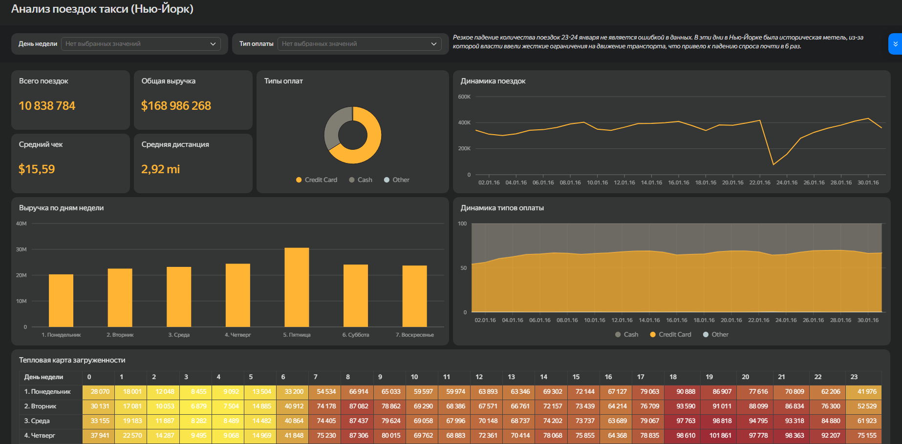

# Анализ экономики городского такси (NYC Yellow Cab)

## Бизнес-задача
Комплексное исследование экономики и пользовательского поведения в сервисе городского такси для пассажиров и водителей. 
Цель проекта - выявить скрытые закономерности в финансовом учете, проверить алгоритмы ценообразования и определить влияние внешних факторов и пиковых нагрузок на спрос и предложение.

## Происхождение и описание данных
Источником данных - официальный открытый датасет **New York City Taxi and Limousine Commission (NYC TLC)** по поездкам желтых такси (Yellow Cab). 
Исходный массив представляет собой сырые логи объемом более 1.5 ГБ, содержащие гео-метки, временные штампы и финансовую детализацию каждой поездки.

## Стек технологий и архитектура решения
Проект реализован в виде полного аналитического цикла:
1. **PostgreSQL:** фильтрация сырых логов и отсечение системных аномалий (нулевые поездки, отрицательные чеки). Генерация новых признаков (расчет длительности поездок) и выгрузка чистого семпла в 500 000 строк.
2. **EDA (Python):** исследование матрицы корреляций, анализ поведения пассажиров и суточного распределения нагрузки с использованием библиотек Pandas, Seaborn и Matplotlib.
3. **BI (Yandex DataLens):** создание интерактивного дашборда для мониторинга ключевых метрик.

## Главные инсайты
* **Экономика поездок и тарификация:** типичная поездка совершается на короткое расстояние (до 3 миль) с медианным чеком $11-12. Выявлена сильная линейная зависимость (корреляция 0.87) между дистанцией и итоговой стоимостью. Это доказывает, что алгоритм ценообразования работает прозрачно, без скрытых переплат для пользователей.
* **Спрос:** минимум нагрузки фиксируется в 05:00 утра, абсолютный пик спроса достигается к 18:00, в это время логичнее вводить повышенные коэфициенты для мотивации водитилей выходить на линию.
* **Учет чаевых:** при безналичной оплате чаевые стабильно фиксируются системой (в среднем 15.5% от чека), однако при оплате наличными в базу всегда уходит 0. Это не жадность клиентов, а системный артефакт передачи наличных из рук в руки, который важно учитывать при расчете реального дохода водителя.
* **Влияние макрособытий (аномалии):** на дашборде зафиксировано резкое падение количества поездок 23-24 января 2016 года (спрос упал почти в 6 раз). Это не техническая ошибка сбора данных, а влияние исторической метели, из-за которой власти ввели жесткие ограничения на движение транспорта.

## BI-Дашборд
[ОТКРЫТЬ ДАШБОРД](https://datalens.yandex/pb9ikdumnes08)

## Внутри репозитория
* `data_preparation.sql` - SQL-скрипт очистки данных и формирования витрин.
* `analysis.ipynb` - Jupyter Notebook с подробным исследовательским анализом и визуализацией.
